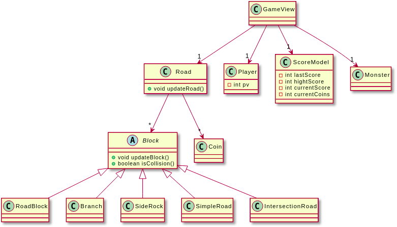

# TempleRunner
TempleRunner est un jeu mobile qui met en scène un personnage qui doit survivre à l’attaque d’un monstre. Cette application pouvant être déployée sur des terminaux iOS et Android, permet également aux utilisateurs de pouvoir échanger entre eux via une section de chat. 
 

 
# PARTIE IOS
 
Le code de la partie IOS est divisé en 3 Package : 
- Model contenant l'ensemble de la logique derrière le jeu
- Util les class utilitaires
- Views qui contient l’ensemble des views.
 
## Utilisation de button et d’une font personnalisée
Utilisation d’extension pour définir une méthode générique pour personnaliser un bouton ou un label 
 
## Architecture du jeu

 
## Player:
 
Player pouvant courir et éviter des obstacles en swipant soit en haut soit en bas, peut se déplacer de gauche à droite en inclinant l’appareil et peut changer de route en swipant à gauche ou à droite. L'état courant du joueur est mis à jour pour chacune de ces actions.
 
## Road :
 
La route est composée de Blocks, on peut y stocker dans chacun de ces Blocks, un obstacle qui devra être évité par le Player, ou des pièces que le Player va tenter de collecter.
Aléatoirement, les obstacles et les pièces attendent certaines conditions pour pouvoir se placer sur le prochain bloc qui va apparaître en haut de l'écran.
Les obstacles sont remis en haut en attente d'être sélectionnés à nouveau, et les pièces vont s’afficher en séquence.
À un certain moment, lorsque c’est possible une intersection est générée qui indique au Player de tourner à gauche ou à droite dès que c’est possible.
Au cours du jeu, la détection de collisions est activée pour les obstacles et les pièces.
 
 
## GameView : 
 
View contenant l’ensemble du jeu. 
On y affiche le score actuel du Player, ce score s'incrémente toutes les 0.1ms, tant que le joueur réussit à avancer. Le nombre de pièces récoltées y est aussi affiché et va faire progresser une jauge, qui augmente en fonction du nombre de pièces récoltées permettant d’activer un pouvoir d’accélération une fois cette jauge remplie.
Depuis GameView on peut naviguer vers ScoreView pour mettre en pause le jeu ou alors le ScoreView est affiché à partir du moment où le Player perd.
 
## ScoreView :
 
Menu permettant de jouer à une nouvelle partie ou à envoyer son high score aux autres joueurs.
Sert aussi de menu de pause du jeu. Menu apparaissant au-dessus d'une autre vue avec animation. 
 
 
## Temporisation après pause 
 
Création d’une temporisation avec compteur à l’écran pendant 3 secondes avant la reprise du jeu.
 
## Backend score :
 
Ajout des deux appels à une API pour ajouter un score à diffuser aux autres joueurs de l'application et une autre appelée qui regarde si un score doit être notifié au joueur.
 
## Identifiant user et persistance :
 
Appel à l'API à l'ouverture de l'application pour récupérer un identifiant unique pour chaque device. Enregistrement dans un dossier persistant et tester à la prochaine ouverture, utilisation de cet identifiant si présent dans le dossier persistant.
 
 
## Monster :
 
Monstre avec animation poursuivant le joueur à chaque point de vie perdu du joueur, le monstre se rapproche.
Tue le jouer quand ces points sont à zéro.
 
## Fin de partie 
 
La fin d’une partie est déclenchée lorsque le joueur meurt (plus de vies, collisions ou sortie de route). On a donc un affichage du score du joueur et on sauvegarde le dernier score dans le ScoreModel avec mise à jour du high score si besoin. 
 
# Partie Android
 
Le code de la Partie Android est divisé comme suit :
- templerunner_android : contient toutes les activitées de l’application ainsi que les classes chargée des communications
- templerunner_android.GameLogic  : qui correspondont à la base de donnée, contient l’ensemble des classes permettant la gestion du jeux et du score 
- templerunner_android.Util : les enum utilisé dans le code
 
## GameView 
SurfaceView contenant l’ensemble de l’affichage et capture de mouvement du jeu.
 
## ScoreView 
 
Menu permettant de jouer à une nouvelle partie ou à envoyer son high score aux autres joueurs.
Peut aussi être invoqué par l’appuis sur le bouton “PAUSE” du GameView. Menu sans animation. 
 
## API Score et Chat
 
Deux appels pour les scores et trois autres pour le chat. Permet de récupérer le nombre de messages non lus (non affichés dans la partie messageActivity) et de les rajouter. Utilisation de volley , gson et de la persistance des données pour l’identifiant (similaire à IOS).
 
# Backend
 
## Serveur 
 
Utilisation d’un serveur django avec une base de données sqlite  déployée sur pythonanywhere. 
 
Utilisation de trois tables
-User(les identifiants)
-Score(les scores qui sont à notifier aux autres joueurs)
-Messages(tous les messages envoyés par les joueurs)
 
scores retirés de la table Score après avoir été lu.
 

